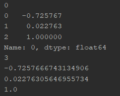

# 1. Reading in data

## 1.1 pd.read_csv

When I iterated through the rows, I found that my first row was skipped. Here is the code that shows the reading

```python
df = pd.read_csv('data/1/train_1_5.csv')

for rows in df.iterrows():
    print(rows[0])
    print(rows[1])
    print(len(rows[1]))
    print(rows[1][0])
    print(rows[1][1])
    print(rows[1][2])
```

The result for the first index is 


Whereas the first 2 rows

```
-7.257666743134905118e-01,2.276305646955734119e-02,1.000000000000000000e+00
-8.112730906323122326e-01,3.552440931525779888e-02,1.000000000000000000e+00
```

Hence, we need to add `header=None`

Link: https://stackoverflow.com/questions/29287224/pandas-read-in-table-without-headers



# 2. Numpy functions

## 2.1 Creating a numpy array

Link: https://docs.scipy.org/doc/numpy/user/basics.creation.html

NOTE: Array creation requires us to use SQUARE BRACKETS `[]`

Creating an array from values that we know 

```python
>>> x = np.array([2,3,1,0])
>>> x = np.array([2, 3, 1, 0])
>>> x = np.array([[1,2.0],[0,0],(1+1j,3.)]) # note mix of tuple and lists,
    and types
>>> x = np.array([[ 1.+0.j, 2.+0.j], [ 0.+0.j, 0.+0.j], [ 1.+1.j, 3.+0.j]])
```

Creating an array of zeroes

```python
>>> np.zeros((2, 3))
array([[ 0., 0., 0.], [ 0., 0., 0.]])
```

Creating an array with sequential elements 

```python
>>> np.arange(10)
array([0, 1, 2, 3, 4, 5, 6, 7, 8, 9])
>>> np.arange(2, 10, dtype=float)
array([ 2., 3., 4., 5., 6., 7., 8., 9.])
>>> np.arange(2, 3, 0.1)
array([ 2. , 2.1, 2.2, 2.3, 2.4, 2.5, 2.6, 2.7, 2.8, 2.9])
```


## 2.2 Dot product to get a scalar

Link: https://docs.scipy.org/doc/numpy/reference/generated/numpy.inner.html

The example they gave was self-explanatory 

```python
>>> a = np.array([1,2,3])
>>> b = np.array([0,1,0])
>>> np.inner(a, b)
2
```

Alternatively,

Link: https://stackoverflow.com/questions/51711790/numpy-dot-product-returning-either-a-np-array-or-a-float

```python
np.array([1, 1]).dot(np.array([2, -10]))
# -8
```


## 2.3 Numpy reshape

Link: https://docs.scipy.org/doc/numpy/reference/generated/numpy.reshape.html

-  ‘F’ means to read / write the elements using Fortran-like index order, with the first index changing fastest, and the last index changing slowest.

```python
>>> a = np.array([[1,2,3], [4,5,6]])
>>> np.reshape(a, 6)
array([1, 2, 3, 4, 5, 6])
>>> np.reshape(a, 6, order='F')
array([1, 4, 2, 5, 3, 6])
>>> np.reshape(a, (3,-1))       # the unspecified value is inferred to be 2
array([[1, 2],
       [3, 4],
       [5, 6]])
```

## 2.4 Adding a column of 1s to the vector


