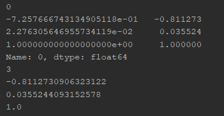

# 1. Reading in data

## 1.1 pd.read_csv

### 1.1.1 Reading with no headers

When I iterated through the rows, I found that my first row was skipped. Here is the code that shows the reading

```python
df = pd.read_csv('data/1/train_1_5.csv')

for rows in df.iterrows():
    print(rows[0])
    print(rows[1])
    print(len(rows[1]))
    print(rows[1][0])
    print(rows[1][1])
    print(rows[1][2])
```

The result for the first index is 



Whereas the first 2 rows

```
-7.257666743134905118e-01,2.276305646955734119e-02,1.000000000000000000e+00
-8.112730906323122326e-01,3.552440931525779888e-02,1.000000000000000000e+00
```

Hence, we need to add `header=None`

Link: https://stackoverflow.com/questions/29287224/pandas-read-in-table-without-headers


### 1.1.2 Reading with no headers and specifying the columns to be used

Link:https://stackoverflow.com/questions/29287224/pandas-read-in-table-without-headers

```python
df = pd.read_csv(file_path, header=None, usecols=[3,6])
```


## 1.2 Reading .dat files

Link:https://stackoverflow.com/questions/27413843/difficulty-importing-dat-file

```python
import pandas as pd    

with open('/tmp/invest.dat','r') as f:
    next(f) # skip first row
    df = pd.DataFrame(l.rstrip().split() for l in f)

print(df)
```


# 2. Numpy functions

## 2.1 Creating a numpy array

Link: https://docs.scipy.org/doc/numpy/user/basics.creation.html

NOTE: Array creation requires us to use SQUARE BRACKETS `[]`

Creating an array from values that we know 

```python
>>> x = np.array([2,3,1,0])
>>> x = np.array([2, 3, 1, 0])
>>> x = np.array([[1,2.0],[0,0],(1+1j,3.)]) # note mix of tuple and lists,
    and types
>>> x = np.array([[ 1.+0.j, 2.+0.j], [ 0.+0.j, 0.+0.j], [ 1.+1.j, 3.+0.j]])
```

Creating an array of zeroes

```python
>>> np.zeros((2, 3))
array([[ 0., 0., 0.], [ 0., 0., 0.]])
```

Creating an array with sequential elements 

```python
>>> np.arange(10)
array([0, 1, 2, 3, 4, 5, 6, 7, 8, 9])
>>> np.arange(2, 10, dtype=float)
array([ 2., 3., 4., 5., 6., 7., 8., 9.])
>>> np.arange(2, 3, 0.1)
array([ 2. , 2.1, 2.2, 2.3, 2.4, 2.5, 2.6, 2.7, 2.8, 2.9])
```


## 2.2 Dot product to get a scalar

Link: https://docs.scipy.org/doc/numpy/reference/generated/numpy.inner.html

The example they gave was self-explanatory 

```python
>>> a = np.array([1,2,3])
>>> b = np.array([0,1,0])
>>> np.inner(a, b)
2
```

Alternatively,

Link: https://stackoverflow.com/questions/51711790/numpy-dot-product-returning-either-a-np-array-or-a-float

```python
np.array([1, 1]).dot(np.array([2, -10]))
# -8
```


## 2.3 Numpy reshape

Link: https://docs.scipy.org/doc/numpy/reference/generated/numpy.reshape.html

-  ‘F’ means to read / write the elements using Fortran-like index order, with the first index changing fastest, and the last index changing slowest.

```python
>>> a = np.array([[1,2,3], [4,5,6]])
>>> np.reshape(a, 6)
array([1, 2, 3, 4, 5, 6])
>>> np.reshape(a, 6, order='F')
array([1, 4, 2, 5, 3, 6])
>>> np.reshape(a, (3,-1))       # the unspecified value is inferred to be 2
array([[1, 2],
       [3, 4],
       [5, 6]])
```

## 2.4 Adding a column of 1s to the vector

Link: https://stackoverflow.com/questions/8486294/how-to-add-an-extra-column-to-a-numpy-array

```python
x = np.array(df['x'])
x = np.c_[x, np.ones(len(df))]
```

## 2.5 Numpy array into df column

Link: https://stackoverflow.com/questions/44424594/converting-numpy-array-into-dataframe-column

- Note: useful to see how they initialize an empty dataframe 

```python
import pandas as pd
import numpy as np

df = pd.DataFrame()

for i in range(5):
    arr = np.random.rand(10)
    df[i] = arr
```

## 2.6 Inverse a matrix

Link: https://www.tutorialspoint.com/numpy/numpy_inv.htm

- Important part is `y = np.linalg.inv(x) `

```python
Live Demo
import numpy as np 

x = np.array([[1,2],[3,4]]) 
y = np.linalg.inv(x) 
print x 
print y 
print np.dot(x,y)
'''
x is:
[[1 2]                                                                        
 [3 4]]
y is:
[[-2.   1. ]                                                                  
 [ 1.5 -0.5]]
The result of the dot product is:
[[  1.00000000e+00   1.11022302e-16]                                          
 [  0.00000000e+00   1.00000000e+00]]
'''
```

## 2.7 Transpose a vector

Link: https://docs.scipy.org/doc/numpy/reference/generated/numpy.transpose.html

```python
>>> x = np.arange(4).reshape((2,2))
>>> x
array([[0, 1],
       [2, 3]])
>>> np.transpose(x)
array([[0, 2],
       [1, 3]])
```


# 3. Dataframe functions

## 3.1 Error: pandas DataFrame “no numeric data to plot” error

Link: https://stackoverflow.com/questions/31494870/pandas-dataframe-no-numeric-data-to-plot-error

- Why? The data is read as Strings 
- Solution: Force the data to be floats `df=df.astype(float)`

## 3.2 Plotting Scatter plots 

Link: https://pandas.pydata.org/pandas-docs/stable/user_guide/visualization.html

Method 1: The dataframe way

- `a` and `b` are columns in the dataframe 

```python
import matplotlib as plt
df = pd.DataFrame(np.random.rand(50, 4), columns=['a', 'b', 'c', 'd'])
df.plot.scatter(x='a', y='b')
```

- If we want to do different data with different colors on the same plot

```python
ax = df.plot.scatter(x='a', y='b', color='DarkBlue', label='Group 1');
df.plot.scatter(x='c', y='d', color='DarkGreen', label='Group 2', ax=ax);
```

## 3.3 Dropping rows

### 3.3.1 Dropping the last n rows

Link: https://stackoverflow.com/questions/26921651/how-to-delete-the-last-row-of-data-of-a-pandas-dataframe

```python
# Drop last n rows
df.drop(df.tail(n).index,inplace=True)
# Drop first n rows
df.drop(df.head(n).index,inplace=True) 
```

### 3.3.2 Delete rows by column value

Link: https://thispointer.com/python-pandas-how-to-drop-rows-in-dataframe-by-conditions-on-column-values/

```python
print("Delete all rows for which column 'Age' has value 30")


# Get names of indexes for which column Age has value 30
indexNames = dfObj[ dfObj['Age'] == 30 ].index

# Delete these row indexes from dataFrame
dfObj.drop(indexNames , inplace=True)
```

## 3.4 Renaming columns

Link: https://cmdlinetips.com/2018/03/how-to-change-column-names-and-row-indexes-in-pandas/

```python
gapminder.rename(columns={'pop':'population',
                          'lifeExp':'life_exp',
                          'gdpPercap':'gdp_per_cap'}, 
                 inplace=True)
print(gapminder.columns)
'''
Index([u'country', u'year', u'population', u'continent', u'life_exp',
       u'gdp_per_cap'],
      dtype='object')
'''
gapminder.head(3)
'''
       country  year  population continent  life_exp  gdp_per_cap
0  Afghanistan  1952     8425333      Asia    28.801   779.445314
1  Afghanistan  1957     9240934      Asia    30.332   820.853030
2  Afghanistan  1962    10267083      Asia    31.997   853.100710
'''
```

