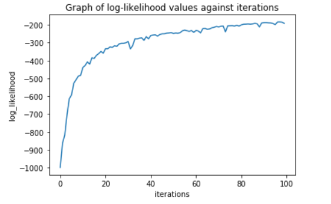

# Glenn Chia 1003118

01.112 Machine Learning Homework 3

# 1. Run LIBSVM to classify promoters with different kernels (0-3), using default values for all other parameters. What is your test accuracy for each kernel choice?

# 2(a) What is `w` and what is the margin $\gamma$

The points are linearly separable and the weight vector w must be such that we maximize the margins. 

**<u>We have 2 equations</u>**:

- Equation 1: w.x1 + 0 = 1 (Since bias is 0)
- Equation 2: w.x2 + 0 = -1

**For x1**, 

wx.(1) + wy.(1) + 0 = 1

wx + wy = 1 eqn(1)

**For x2**, 

wx.(1) + wy.(0) + 0 = -1

wx = -1 eqn(2)

**Sub (2) into (1)**

-1 + wy = 1 

wy = 2

**<u>Hence, w = (-1, 2)</u>**

The margin is given by $\frac{1}{||w||}$, which is $\frac{1}{\sqrt[]{(-1)^2 + 2^2}}$ = $\frac{1}{\sqrt[]{5}}$

**<u>Hence, margin is $\frac{1}{\sqrt[]{5}}$</u>**

# 2(b) What happens if bias is allowed to be non-zero

This means that the bias could have a value (In this case there is a value, calculated below). This means that the weights, w may also be different.

The maximum distance between the 2 vectors is via a line connecting the 2 points. This line will be perppendicular to the weight vector and parallel to the boundary. The maximum distance is given by $\sqrt{(1-1)^2 + (1-0)^2}$ = 1

The distance from the margins to the boundary is half of that which is 0.5. The formula to calculate this distance is given by $\frac{1}{||\theta||}$

Hence,

- $\frac{1}{||\theta||} = \frac{1}{2}$
- $\sqrt{w_{x}^2 + w_{y}^2} = 2$
- $w_{x}^2 + w_{y}^2 = 4$ eqn(1)

<u>**Using the margins and the boundary equation**</u>

Step 1: find a data point on the boundary

- Find the average between the support vectors = ($\frac{1+1}{2}$, $\frac{1+0}{2}$ )= (1, 0.5)

First equation for support vector (1,1)

- $w_{x}(1) + w_{y}(1) + \theta _{0} = 1$
- $w_{x} + w_{y} + \theta _{0} = 1$  eqn(2)

Second equation for support vector (1,0)

- $w_{x}(1) + w_{y}(0) + \theta _{0} = -1$
- $w_{x} + \theta _{0} = -1$
- $\theta _{0} = -1 - w_{x}$ eqn(3)

Substitute (3) into (2) 

- $w_{x} + w_{y} - 1 - w_{x} = 1$
- $w_{y} = 2$

Substitute $w_{y} = 2$ into (1)

- $w_{x}^2 + 2^2 = 4$ 
- $w_{x}^2 = 0$
- $w_{x} = 0$

Substitute  $w_{x} = 0$ into (3)

$\theta _{0} = -1 - 0$ 

$\theta _{0} = -1$ 

<u>**Final answers**</u>

w = (0, 2)

bias, $\theta _{0} = -1$ 

# 3. Question 3 [20 points] In this problem, we consider constructing new kernels by combining existing kernels. Recall that for some function K(x, z) to be a kernel, we need to be able to write it as an inner product of vectors from some high-dimensional feature space

## 3.1 K(x, z) = K1(x, z)K2(x, z)

Yes, it is a kernel

By Property 4 of the rules of the kernel, since K1 and K2 are kernels, this means that their product is also a kernel

## 3.2 K(x, z) = aK1(x, z) + bK2(x, z), where a, b > 0 are real numbers

Yes, it is a kernel

For aK1(x, z) where a can be thought of as a real valued function of x, for example a =cx where cx>0. Thus, aK1(x, z) by property 2 is a kernel function

The same can be used for bK1(x, z) since b>0

Hence, applying property 3, the sum of 2 kernels is still a kernel

## 3.3 K(x, z) = aK1(x, z) - bK2(x, z), where a, b > 0 are real numbers

Not a kernel.

To simplify the problem, assume that K1 and K2 and K are the same kernel and b>a, specifically b=2, a=1.

This means that we get k(x, z) = k1(x,z)-2k1(x,z) = -k1(x,z) = -k(x,z)

Essentially we get k(x,z) = -k(x,z) which is violates the symmetric property of the kernel since k(x,z) != k(-x,-z)

## 3.4 K(x, z) = f(x)f(z), where f : Rn -> R be any real valued function of x.

Yes it is a kernel function.

Based on property 2, we have

We start with the right hand side of the equation

f(x)f(z) = f(x) (1) f(z) = f(x) K'(x,z) f(z) where K'(x,z) =1

Property 1 states that K'(x,z) =1 is a kernel function.

Using property 2, since K'(x,z) =1 is a kernel function and , since f : Rn -> R be any real valued function of x, 

k(x,z) =  f(x) K'(x,z) f(z) which means that k(x,z) is a kernel function

# 4(a). What computational advantage does Equation 2 have over Equation 1?

Equation 1 multiplies probabilities together which range from 0 to 1. This means that every product is smaller or equal to its inputs. If we exclude 0 and 1, it will always get smaller.  Even for a high probability like 0.9, if we multiply them together 1000 times, we get 1.757x10-46 which is a very small number. This could give computation issues such as a floating point issue or underflow if the number is too small.

Thus, we have equation 2 which is now the summation of logs. Equation 2 has a log equation on the inside and we know that the range of a log function is from (0, $\infty$). This means that the input into the log function is from (1, $\infty$) since we add 1. In this range, the log function is greater than 0 and we are summing up these terms which means that it will not converge to 0 unlike equation 1.

# 4(b) Run SGD for 10,000 iterations, and save the model weights after every 100
iterations. Plot the log-likelihood of the training data given by your model at every 100 iterations.

Plot of log-likelihood

