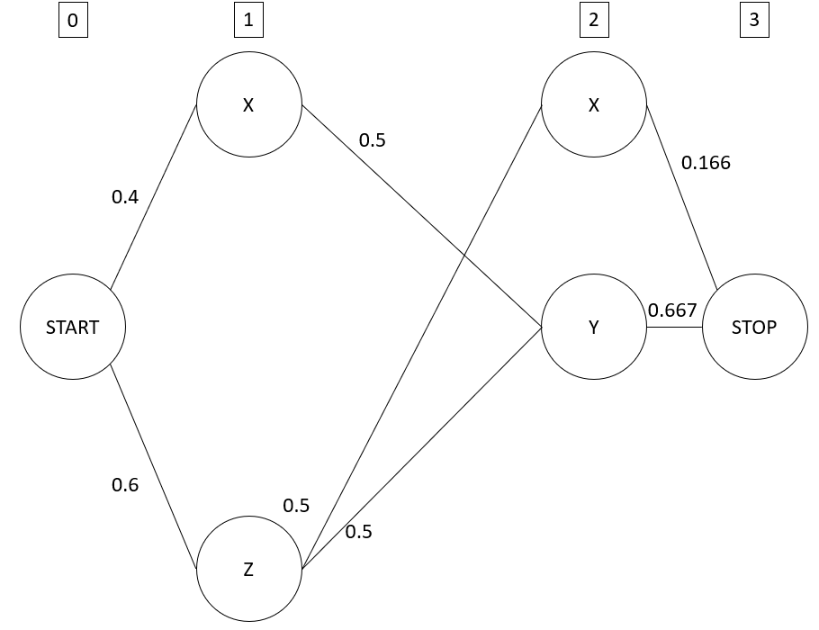

# Question 1: Clearly state what are the parameters associated with the HMM. Under the maximum likelihood estimation (MLE), what would be the values for the optimal model parameters? Clearly show how each parameter is estimated exactly. (10 points)

## 1.1 Parameters associated with MLE

The HMM is defined by a tuple $<T, O, \theta>$

- $T$ is the set of states including `START` and `STOP` states
- $O$ is the set of observation symbols
- $\theta$ is the 
  - Transition probability $a_{u, v}$
  - Emission probability $b_{u}(o)$

## 1.2 Values for the optimal model parameters

$T$ is derived based on the longest possible state sequence which determines the number of words. Since the longest state sequence is (Z,Y,X,Z,Y), there are 5 states between the `START` and `STOP` 

$T$  = {START, 1, 2, 3, 4, 5, STOP}

$O$ is derived from all the unique onservation symbols in the training set. We see that there is a, b, c.

Hence $O$ = {a, b, c}

<u>**Transitions probability calculations**</u>

Table of counts for the transitions

| u\v   | X    | Y    | Z    | STOP |
| ----- | ---- | ---- | ---- | ---- |
| START | 2    | 0    | 3    | 0    |
| X     | 0    | 3    | 2    | 1    |
| Y     | 1    | 0    | 1    | 4    |
| Z     | 3    | 3    | 0    | 0    |

Counting the total number of transitions 

- Inner transitions = 3 + 2 + 4 + 2 + 2 = 13
- Outer Transitions (Start and Stop) = 5(2) = 10
- Total transitions = 13 + 10 = 23

Count specific occurrences

| State | Count |
| ----- | ----- |
| Start | 5     |
| X     | 6     |
| Y     | 6     |
| Z     | 6     |

Estimates for transition probabilities $a_{u, v}$

- $a_{u, v} = \frac{count(u, v)}{count(u)}$ 

| u\v   | X           | Y         | Z           | STOP        |
| ----- | ----------- | --------- | ----------- | ----------- |
| START | 2/5 = 0.4   | 0/5 = 0   | 3/5 = 0.6   | 0/5 = 0     |
| X     | 0/6 = 0     | 3/6 = 0.5 | 2/6 = 0.333 | 1/6 = 0.166 |
| Y     | 1/6 = 0.166 | 0/6 = 0   | 1/6 = 0.166 | 4/6 = 0.667 |
| Z     | 3/6 = 0.5   | 3/6 = 0.5 | 0/6 = 0     | 0/6 = 0     |

<u>**Emission probability calculations**</u>

Table of counts for the transitions between state and output count(u→o)

| u\o  | a             | b             | c             |
| ---- | ------------- | ------------- | ------------- |
| X    | 0+1+0+0+0 = 1 | 2+0+0+1+0 = 3 | 0+0+1+0+1 = 2 |
| Y    | 0+1+0+1+0 = 2 | 0+0+0+0+0 = 0 | 1+0+2+0+1 = 4 |
| Z    | 1+0+0+0+0 = 1 | 0+0+2+0+0 = 2 | 0+1+0+1+1 = 3 |

Estimates for Emission probabilities $b_{u} (o)$

- $b_{u} (o)= \frac{count(u ->o)}{count(u)}$ 

| u\o  | a            | b            | c            |
| ---- | ------------ | ------------ | ------------ |
| X    | 1/6 = 0.166  | 3/6 = 0.5    | 2/6 = 0. 333 |
| Y    | 2/6 = 0. 333 | 0/6 = 0      | 4/6 = 0.667  |
| Z    | 1/6 = 0.166  | 2/6 = 0. 333 | 3/6 = 0.5    |

# Question 2. Now, consider during the evaluation phase, you are given the following new observation sequence. Using the parameters you just estimated from the data, find the most probable state sequence using the Viterbi algorithm discussed in class. Clearly present the steps that lead to your final answer. (10 points)

Diagram 

Diagram after removing the 0s

