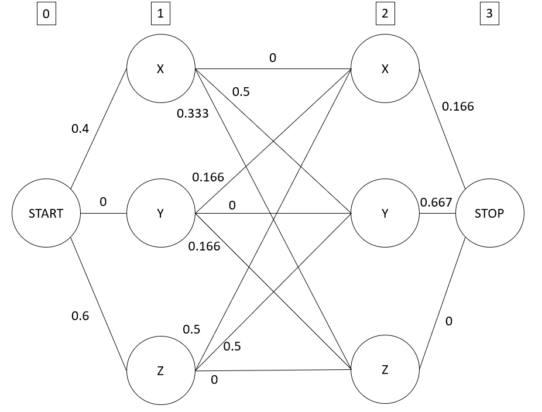
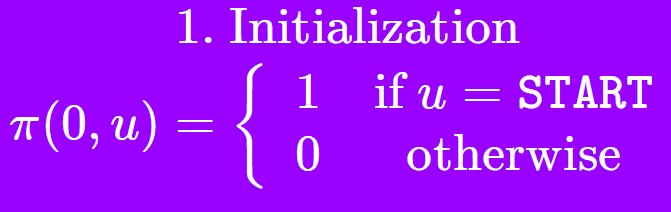
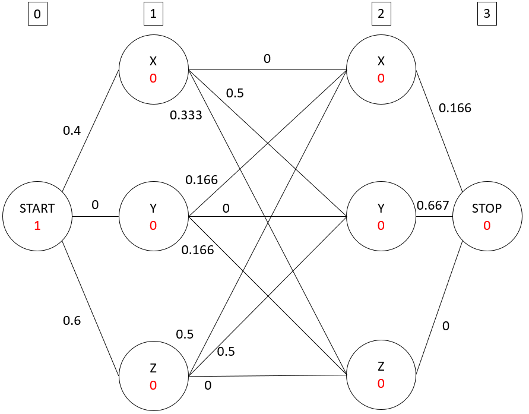
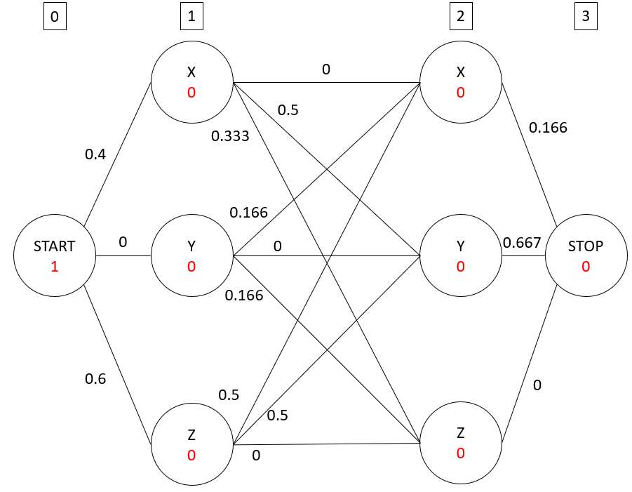
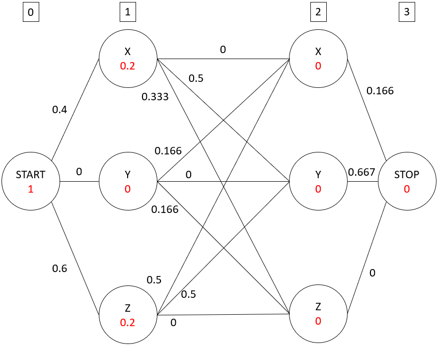
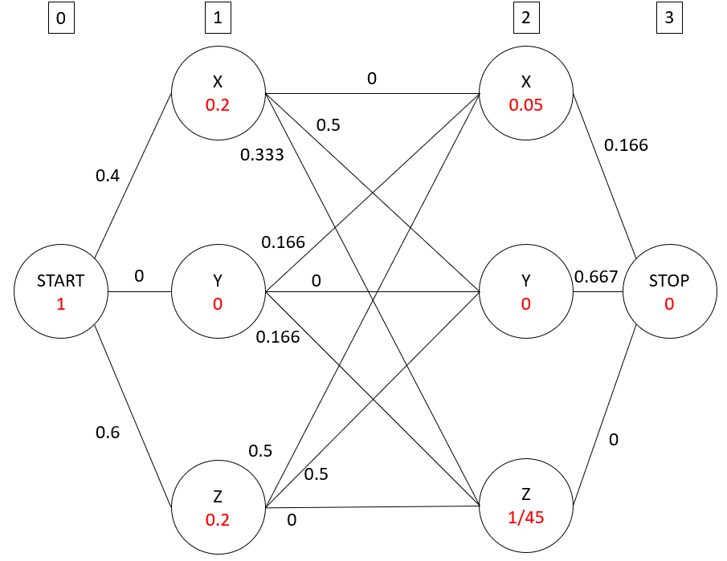
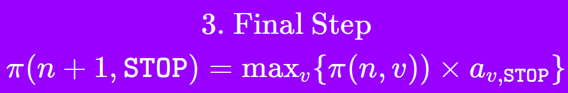
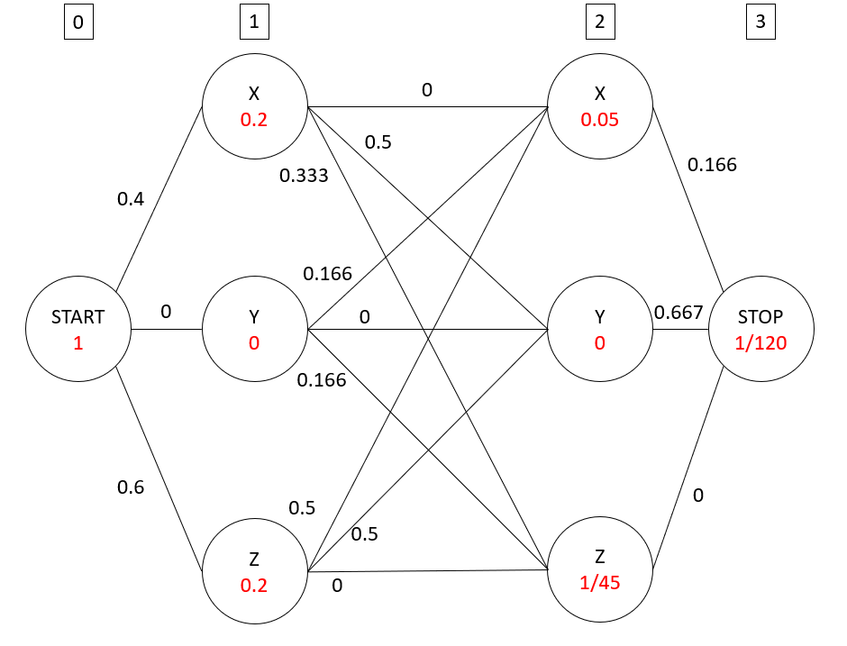
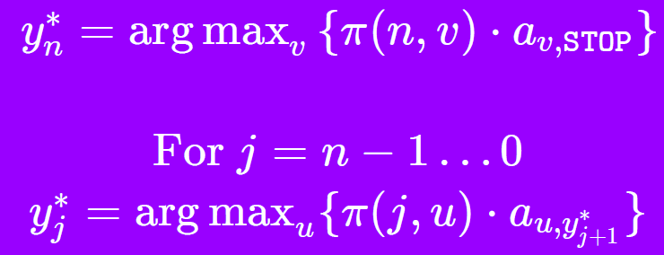

# Question 1: Clearly state what are the parameters associated with the HMM. Under the maximum likelihood estimation (MLE), what would be the values for the optimal model parameters? Clearly show how each parameter is estimated exactly. (10 points)

## 1.1 Parameters associated with MLE

The HMM is defined by a tuple $<T, O, \theta>$

- The parameter that we are interested in is $\theta$ which comprises of 2 very important parameters 
  - Transition probability $a_{u, v}$
  - Emission probability $b_{u}(o)$

## 1.2 Values for the optimal model parameters

<u>**Transitions probability calculations $a_{u, v}$**</u>

Table of counts for the transitions $count(u, v)$

| u\v   | X    | Y    | Z    | STOP |
| ----- | ---- | ---- | ---- | ---- |
| START | 2    | 0    | 3    | 0    |
| X     | 0    | 3    | 2    | 1    |
| Y     | 1    | 0    | 1    | 4    |
| Z     | 3    | 3    | 0    | 0    |

Counting the total number of transitions 

- Inner transitions = 3 + 2 + 4 + 2 + 2 = 13
- Outer Transitions (Start and Stop) = 5(2) = 10
- Total transitions = 13 + 10 = 23

Count specific occurrences $count(u)$

| State | Count |
| ----- | ----- |
| Start | 5     |
| X     | 6     |
| Y     | 6     |
| Z     | 6     |

Estimates for transition probabilities $a_{u, v}$

- $a_{u, v} = \frac{count(u, v)}{count(u)}$ 

| u\v   | X           | Y         | Z           | STOP        |
| ----- | ----------- | --------- | ----------- | ----------- |
| START | 2/5 = 0.4   | 0/5 = 0   | 3/5 = 0.6   | 0/5 = 0     |
| X     | 0/6 = 0     | 3/6 = 0.5 | 2/6 = 0.333 | 1/6 = 0.166 |
| Y     | 1/6 = 0.166 | 0/6 = 0   | 1/6 = 0.166 | 4/6 = 0.667 |
| Z     | 3/6 = 0.5   | 3/6 = 0.5 | 0/6 = 0     | 0/6 = 0     |

<u>**Emission probability calculations $b_{u}(o)$**</u>

Table of counts for the transitions between state and output count(u→o)

| u\o  | a             | b             | c             |
| ---- | ------------- | ------------- | ------------- |
| X    | 0+1+0+0+0 = 1 | 2+0+0+1+0 = 3 | 0+0+1+0+1 = 2 |
| Y    | 0+1+0+1+0 = 2 | 0+0+0+0+0 = 0 | 1+0+2+0+1 = 4 |
| Z    | 1+0+0+0+0 = 1 | 0+0+2+0+0 = 2 | 0+1+0+1+1 = 3 |

Estimates for Emission probabilities $b_{u} (o)$

- $b_{u} (o)= \frac{count(u ->o)}{count(u)}$ 

| u\o  | a            | b            | c            |
| ---- | ------------ | ------------ | ------------ |
| X    | 1/6 = 0.166  | 3/6 = 0.5    | 2/6 = 0. 333 |
| Y    | 2/6 = 0. 333 | 0/6 = 0      | 4/6 = 0.667  |
| Z    | 1/6 = 0.166  | 2/6 = 0. 333 | 3/6 = 0.5    |

# Question 2. Now, consider during the evaluation phase, you are given the following new observation sequence. Using the parameters you just estimated from the data, find the most probable state sequence using the Viterbi algorithm discussed in class. Clearly present the steps that lead to your final answer. (10 points)

Observation sequence (b, b)

Diagram 

<u>**Viterbi algorithm**</u> 

<u>Step 1: Initialization</u>

Result of step 1

<u>Step 2</u>

**Step 2.1** 

Consider the first layer of nodes after the START, j=0, compute for each node v, 

$\pi(1, u)$ = $max_{v}\{\pi(j,v) \cdot b_{u}(x_{j+1}) \cdot a_{v,u}\}$ = $\pi(0,START) \cdot b_{u}(b) \cdot a_{v,START}$ since there is no need to maximize sine there is only the START node in the previous layer

| v    | $\pi(j,v) \cdot b_{u}(x_{j+1}) \cdot a_{v,u}$ |
| ---- | --------------------------------------------- |
| x    | 1 x 0.5 x 0.4 = 0.2                           |
| y    | 1 x 0 x 0 = 0                                 |
| z    | 1 x 1/3 x 0.6 = 0.2                           |

Updated weight diagram

Step 2.2

Consider the first layer of nodes after the the layer j=1, compute for each node v, 

$\pi(2, u)$ = $max_{v}\{\pi(j,v) \cdot b_{u}(x_{j+1}) \cdot a_{v,u}\}$ = $max_{v}\{\pi(1,v) \cdot b_{u}(x_{b}) \cdot a_{v,u}\}$

| u    | v    | $\pi(1,v) \cdot b_{u}(x_{b}) \cdot a_{v,u}$ |
| ---- | ---- | ------------------------------------------- |
| X    | X    | 0.2 x  0.5 x 0 = 0                          |
| X    | Y    | 0 x 0.5 x 1/6 = 0                           |
| X    | Z    | 0.2 x  0.5 x 0.5 = 0.05                     |
| Y    | X    | 0.2 x 0 x 0.5 = 0                           |
| Y    | Y    | 0 x 0 x 0 = 0                               |
| Y    | Z    | 0.2 x 0 x 0.5 = 0                           |
| Z    | X    | 0.2 x 1/3 x 1/3 = 1/45                      |
| Z    | Y    | 0 x 1/6 x 1/3 = 0                           |
| Z    | Z    | 0.2 x 0 x 1/3 = 0                           |

From this table we can find the max

| u    | $max_{v}\{\pi(1,v) \cdot b_{u}(x_{b}) \cdot a_{v,u}\}$ |
| ---- | ------------------------------------------------------ |
| X    | 0.05                                                   |
| Y    | 0                                                      |
| Z    | 1/45                                                   |

Update the weights

<u>Step 3</u>

Consider the layer of the STOP node which is j=3, compute for each node v, 

$\pi(3, STOP)$ = $max_{v}\{\pi(n,v) \cdot a_{v,u}\}$ = $max_{v}\{\pi(2,v) \cdot a_{v,STOP}\}$

| u    | v    | $\pi(2,v) \cdot a_{v,STOP}$ |
| ---- | ---- | --------------------------- |
| STOP | X    | 0.05 x 1/6 = 1/120          |
| STOP | Y    | 0 x 2/3 = 0                 |
| STOP | Z    | 1/45 x 0 = 0                |

Hence, taking the max we get 1/120 

Update the weights

<u>**Step 4: Find sequences from the weights**</u>

**Start from layer n=2**

$y_{n}^{*} = argmax_{v}\{\pi(n,v)\cdot a_{v,STOP}\}$ = $argmax_{v}\{\pi(2,v)\cdot a_{v,STOP}\}$

| v    | $\pi(2,v)\cdot a_{v,STOP}$ |
| ---- | -------------------------- |
| X    | 1/20 x 1/6 = 1/120         |
| Y    | 0 x 2/3 = 0                |
| Z    | 1/45 x 0 = 0               |

Since the maximum value which is $\frac{1}{120}$ comes from v=X, the label at layer 2 is `X`

**Proceed to layer n =1. Note that the node they transit to is X**

$y_{n}^{*} = argmax_{v}\{\pi(n,v)\cdot a_{v,y^{*}_{j+1}}\}$ = $argmax_{v}\{\pi(1,v)\cdot a_{v,2}\}$

| v    | $\pi(1,v)\cdot a_{v,2}$ |
| ---- | ----------------------- |
| X    | 0.2 x 0 = 0             |
| Y    | 0 x 1/6 = 0             |
| Z    | 0.2 x 0.5 = 0.1         |

Since the maximum value which is 0.1 comes from v=Z, the label at layer 1 is `Z`

**<u>Conclusion</u>**

The state sequence is `{Z, X}`

# Question 3. Clearly describe how to modify the Viterbi algorithm to perform such a new decoding task. (10 points)

We are incorporating knowledge that the observation $x_{i}$ has certain states that does not reach it. The example given is that $y_{i} \neq V$ 

<u>**Step 0: Setting some known facts**</u>

If word = "The", the emission probability from state V (verb) to "The" is 0

if $x_{k}=The$: 

​	$b_{u=V}(x_{k})=0$

<u>**Step 1: Initialization (This step still remains the same)**</u>

- Initialize all the scores of the path to each node to be 0
- Initialize the score of the start node to be 1

<u>**Step 2: This step is modified a bit**</u>

> For j = 0 … n − 1, for each u ∈ T
>
> ​	At a layer j+1,
>
> ​		if xj+1 == "The":
>
> ​			$\pi(j+1, u) = 0$ (We do this because we know that the emission probability is 0 and this saves computation time)
>
> ​		else:
>
> ​			$\pi(v, u) = max_{v}\{\pi(j,v) \cdot b_{u}(x_{j+1}) \cdot a_{v,u}\}$

<u>**Step 3: This is the same**</u>

$\pi(n+1, STOP) = max_{v}\{\pi(n,v) \cdot a_{v,u}\}$

<u>**Step 4: Once the weights are chosen, we need to choose the highest scoring path**</u> 

We consider the final layer first

>  if xn == "The":
>
> ​	$y_{n}^{*} = argmax_{v\neq V}\{\pi(n,v)\cdot a_{v,STOP}\}$
>
> else:
>
> ​	$y_{n}^{*} = argmax_{v}\{\pi(n,v)\cdot a_{v,STOP}\}$

Then we consider the rest of the layers

>  if xn == "The":
>
> ​	$y_{n}^{*} = argmax_{v\neq V}\{\pi(n,v)\cdot a_{v,y^{*}_{j+1}}\}$
>
> else:
>
> ​	$y_{n}^{*} = argmax_{v}\{\pi(n,v)\cdot a_{v,y^{*}_{j+1}}\}$