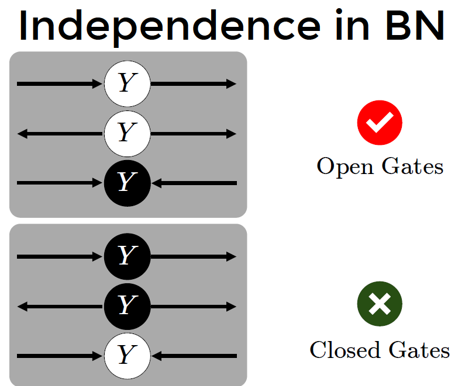
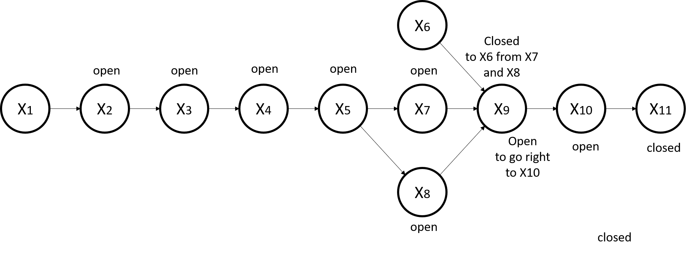
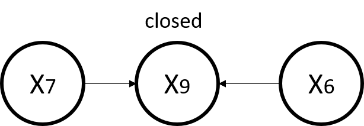
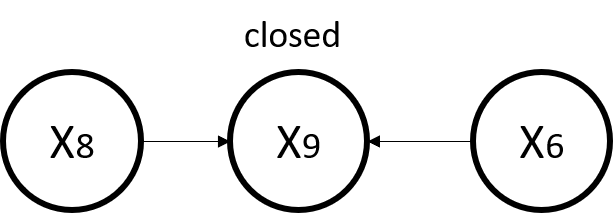
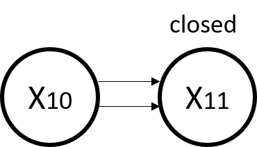
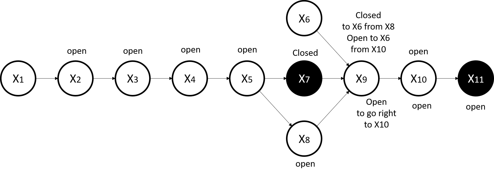
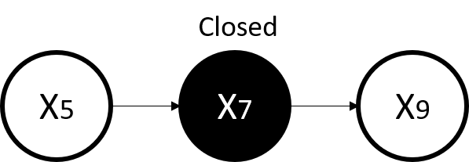
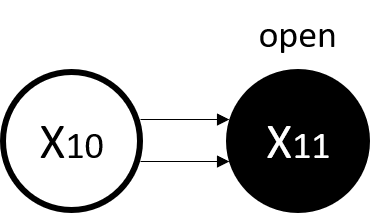
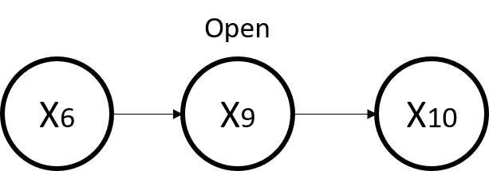
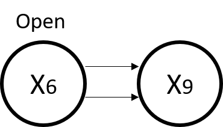

# Glenn Chia 1003118

01.112 Machine Learning Homework 5

# Question 1: Without knowing the actual value of any node, are node X1 and X6 independent of each other? What if we know the value of node X7 and X11? (5 points)

**<u>Part 1: Actual value of any node is unknown</u>**

Yes they are independent 

We use Bayes' ball algorithm to check for independence. If we do not  know any other node, X1 and X6 are independent. This is shown below in the diagram. All the nodes are White nodes because no other nodes are given.

Note that the path between nodes X7, X9, X6 is closed as the direction of the arrows are pointing into X9

Note that the path between nodes X8, X9, X6 is closed as the direction of the arrows are pointing into X9

Even if we continue traversing the graph, we can reach X10 but once we reach X11 we cannot traverse back because it is closed. 

Hence, there are not paths from X1 to X6 as the gates leading there are closed

<u>**Part 2: Now we know the value of nodes X7 and X11**</u>

They are dependent 

Now we are given information about 2 nodes, this changes the diagram a bit and we can shade the 2 nodes black. We then apply the Bayes' Ball algorithm.

We see that X7 is closed 

The difference now is that since we know the value of X11, it is possible for us to go back to X10. 

From X10 we can through X9 which is open. 

X6 will also be open.

Hence Nodes X1 and X6 are not independent if we know nodes X7 and X11. The path is 

X1 -> X2 ->X3 -> X4- > X5 -> X8 -> X9 -> X10 -> X11  -> X10 ->  X9 -> X6

# Question 2: What is the number of free parameters needed to form this Bayesian network? What would be the number of free parameters for the same network if node X3 and X9 can take 3 different values: {1, 2, 3}, and all other nodes can only take 5 different values: {1, 2, 3, 4, 5}? (5 points)

Model the joint probabilities

p( x1, x2, x3, x4, x5, x6, x7, x8, x9, x10, x11) = p(x1) x p(x2|x1) x p(x3|x2) x p(x4|x3) x p(x5|x4) x p(x7|x5) x p(x8|x5) x p(x9|x6,x7,x8) x p(x6) x p(x10|x9) x p(x11|x10) 

<u>**Part 1**</u>

**Consider nodes with no dependency: x1, x6**

Number of free parameters for p(x1) = 2-1 = 1

**Consider nodes with one dependency: x2, x3, x4, x5, x7, x8, x10, x11** 

Number of free parameters for p(x2) = 2 x (2-1) = 2

**Consider nodes with 3 dependencies: x6**

Number of free parameters for p(x2) = 2 x 2 x 2 x (2-1) = 8

**Sum and get the total free parameters**

Total free parameters = 2x1 + 8x2 + 8 = 26

<u>**Part 2: nodes can take different values**</u>

Nodes x3 and x9 can take on 3 different values

Nodes x1, x2, x4, x5, x6, x7, x8, x10, x11 can take on 5 different values

Number of free parameters for x1 = 5-1 = 4

Number of free parameters for x2 = P(x2|x1) = 5 x (5-1) = 20

Number of free parameters for x3 = P(x3|x2) = 5 x (3-1) = 10

Number of free parameters for x4 = P(x4|x3) = 3 x (5-1) = 12

Number of free parameters for x5 = P(x5|x4) = 5 x (5-1) = 20

Number of free parameters for x6 = P(x6) = 5-1 = 4

Number of free parameters for x7 = P(x7|x5) = 5 x (5-1) = 20

Number of free parameters for x8 = P(x8|x5) = 5 x (5-1) = 20

Number of free parameters for x9 = P(x9|x6,x7,x8) = 5 x 5 x 5 x (3-1) = 250

Number of free parameters for x10 = P(x10|x9) = 3 x (5-1) = 12

Number of free parameters for x11 = P(x11|x10) = 5 x (5-1) = 20

Total = 4 + 20 + 10 + 12 +20 + 4 + 20 + 20 + 250 + 12 + 20 = 392

# Question 3

## Question 3(a): Calculate the following conditional probability:

$P(X_{3} = 1 | X_{4} = 1)$ = $\frac{P(X_{3} = 1, X_{4} = 1)}{P( X_{4} = 1)}$

= $\frac{P(X_{4}=1|X_{3}=1)\sum_{a\in\{1,2\}}P(X_{3}=1|X_{2}=a)}{\sum_{b\in\{1,2\}}P(X_{4}=1|X_{3}=b)}$

= $\frac{(0.1)(0.3+0.3)}{0.1+0.5}$

= $\frac{(0.1)(0.6)}{0.6}$

= 0.1

## Question 3(b): Calculate the following conditional probability:

$P(X_{5} = 2 | X_{3} = 2,X_{11} = 2, X_{1} = 2)$

= $\frac{P(X_{5} = 2, X_{3} = 2,X_{11} = 2, X_{1} = 2)}{P(X_{3} = 2,X_{11} = 2, X_{1} = 2)}$

= $\frac{P(X_{1}=2) \cdot \sum_{a \in \{1,2\}}P(X_{5}=2|X_{4}=a)P(X_{4}=a|X_{3}=2) \cdot \sum_{b \in \{1,2\}}P(X_{3}=2|X_{2}=b)\cdot \sum_{c \in \{1,2\}}P(X_{11}=2|X_{10}=c)}{P(X_{1}=2) \cdot \sum_{b \in \{1,2\}}P(X_{3}=2|X_{2}=b)\cdot \sum_{c \in \{1,2\}}P(X_{11}=2|X_{10}=c)\cdot }$ Simplify the numerator and denominator 

= $\sum_{a \in \{1,2\}}P(X_{5}=2|X_{4}=a)P(X_{4}=a|X_{3}=2)$

= $0.5 \cdot 0.5 +0.4 \cdot 0.5$

= 0.45

